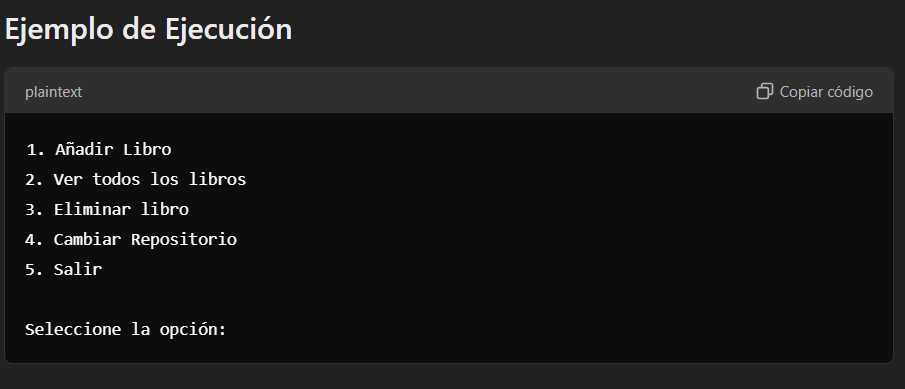

Tech Book Manger
# Tech Books Manager App 
## Descripción **Tech Books Manager App** es una aplicación de consola desarrollada en Java que permite a los usuarios gestionar una colección de libros técnicos de programación. La aplicación proporciona una interfaz interactiva en la consola que permite realizar varias operaciones sobre la colección, como añadir, ver, y eliminar libros.
## Características :
**Añadir Libro**: Agrega un libro proporcionando título, autor e ISBN. El ISBN debe seguir el formato de una letra seguida de tres números (por ejemplo, A123). 
- **Ver todos los libros**: Muestra la lista completa de libros en la colección. 
- **Eliminar libro**: Permite eliminar un libro de la colección introduciendo su ISBN.
- **Cambiar repositorio**: Opción para futuras implementaciones. 
- **Salir de la aplicación**: Cierra el programa.

## Estructura del Código
- **Clase `Imprimir`**: Contiene el menú principal y la lógica de manejo de la colección de libros. Gestiona la interacción con el usuario y las operaciones en la lista de libros. 
- **Métodos clave**: 
- - `imprimir()`: Muestra el menú y controla las opciones seleccionadas. 
- - `addBook()`: Permite añadir un nuevo libro a la lista, validando ISBN único y formato. 
- - `deleteBook()`: Permite eliminar un libro de la lista usando el ISBN. 
- - `imprimirlibros()`: Muestra todos los libros en la colección o un mensaje si la lista está vacía. 

## Instalación 1. 
- Clona este repositorio. 

```bash git clone https://github.com/usuario/tech-books-manager-app.git```
- Navega al directorio del proyecto.

```cd tech-books-manager-app```

- Compila el código fuente.

 ```javac -d bin src/com/alexmonzon/*.java```
- Ejecuta la aplicación.

```java -cp bin com.alexmonzon```

## Uso
- Al iniciar la aplicación, selecciona una opción del menú para gestionar tu colección de libros.
- Sigue las instrucciones en la consola para añadir, ver o eliminar libros.
- Ingresa el ISBN en el formato adecuado (una letra y tres números, como A123) para agregar o eliminar un libro.

## Ejemplo de Ejecución

